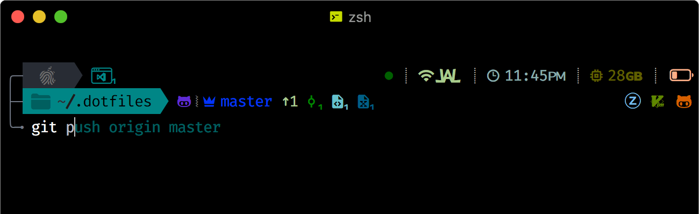

<h1>
  Ultimate ZSH Prompt
</h1>

 

  <h3>Left Top Prompt</h3>
  <ul style="margin-top:-15px">
    <li>
      <b>Segment indicating OS System</b>
    </li>
      &nbsp&nbsp
    <li>
      <b>Segment showing number of open VS Code workspaces</b>
    </li>
      &nbsp&nbsp
  </ul>
  <h3>Left Bottom Prompt</h3>
  <ul style="margin-top:-15px">
     <li>
      <b>Dynamic path display</b>
     </li>
      &nbsp&nbsp
     <li>
      <b>Git status with carefully selected glyphs</b>
     </li>
      &nbsp&nbsp
  </ul>
  <h3>Right Top Prompt</h3>
  <ul style="margin-top:-15px">
    <li>
      <b>Minimal exit status</b>
    </li>
      &nbsp&nbsp
     <li>
      <b>Wifi status</b>
     </li>
      &nbsp&nbsp
     <li>
     <b>Time segment</b>
     </li>
      &nbsp&nbsp
     <li>
      <b>Available memory segment</b>
     </li>
      &nbsp&nbsp
     <li>
      <b>Dynamic battery segment</b>
     </li>
      &nbsp&nbsp
  </ul>
  <h3>Right Bottom Prompt</h3>
  <ul style="margin-top:-15px">
     <li>
      <b>Glyphs indicating relevant dev files in current working directory</b>
      </li>
       &nbsp&nbsp
      <ul>
        <li>
        <b>Glyphs update dynamically upon entering a directory</b>
        </li>
        <li>
          <b>Currently recognized files</b>
           &nbsp <i>zshrc <b>·</b> tmux <b>·</b> vim <b>·</b> dockerfile <b>·</b> node modules <b>·</b> react native (expo) <b>·</b> dylib <b>·</b> md  &nbsp c/cpp <b>·</b> dart <b>·</b> db <b>·</b> html <b>·</b> java <b>·</b> javascript <b>·</b> json <b>·</b> haskell <b>·</b> sql <b>·</b> php <b>·</b> python  &nbsp ruby <b>·</b> rust <b>·</b> sass <b>·</b> swift <b>·</b> typescript <b>·</b> text <b>·</b> less <b>·</b> require js <b>·</b> sqlite</i>
      </li>
     </ul>
  </ul>
